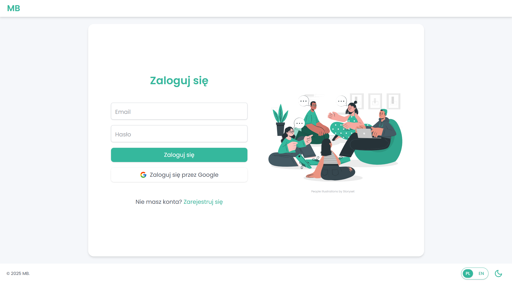
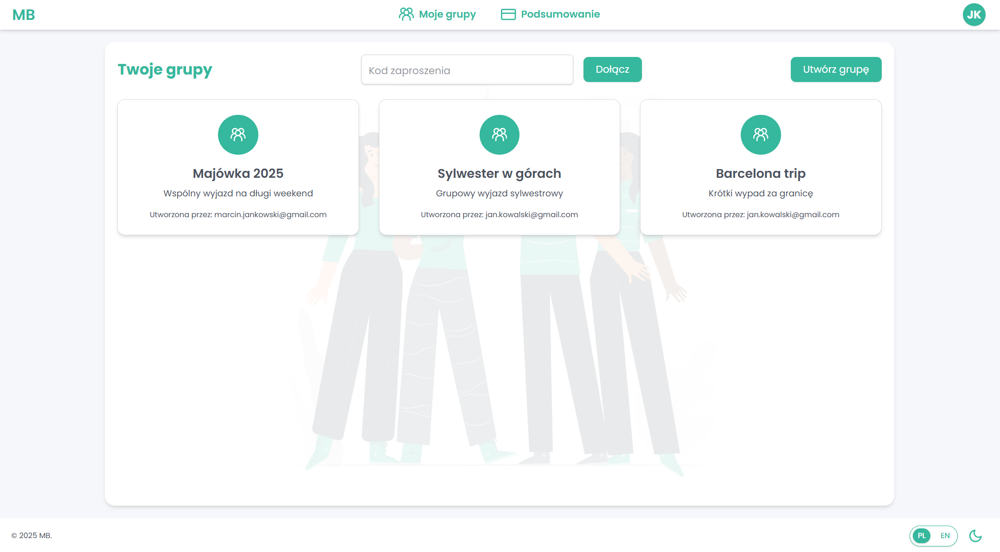
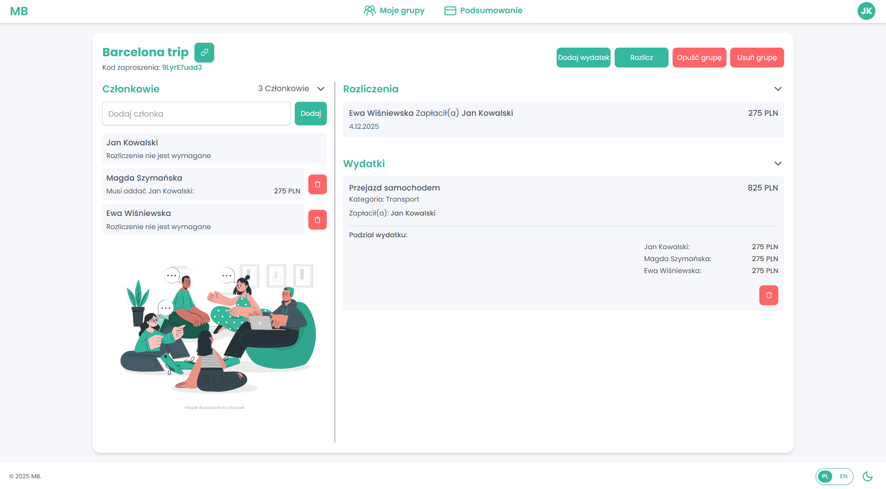
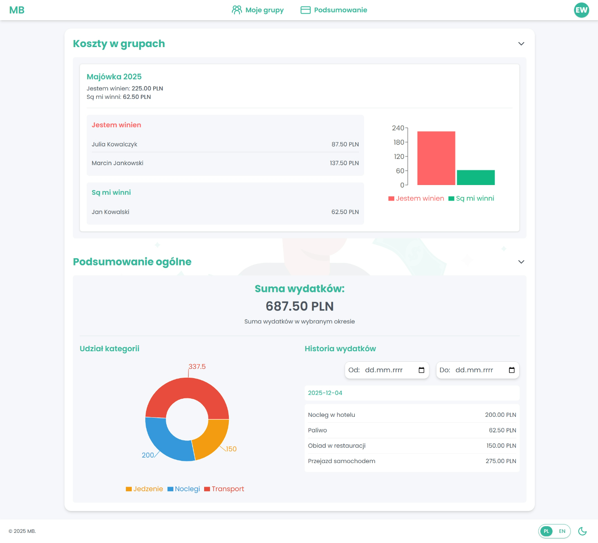
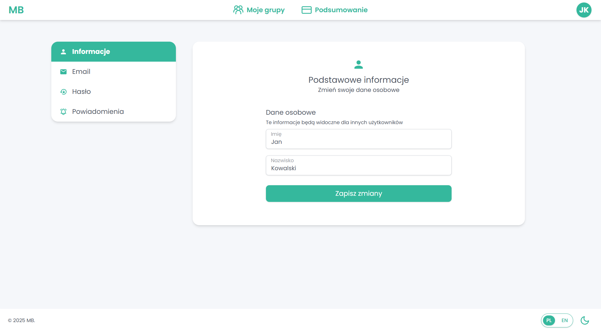
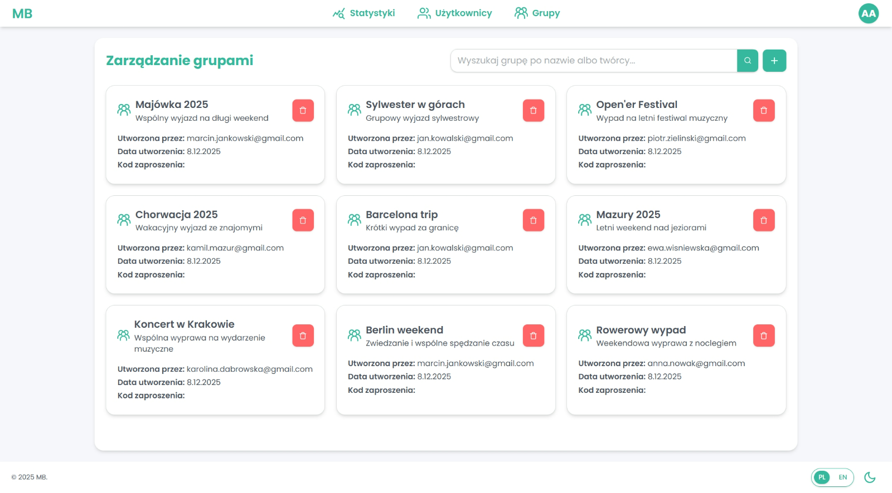
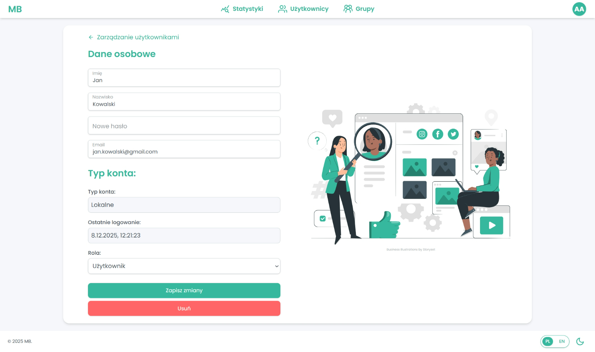

# System for Managing and Settling Shared Costs in User Groups - Engineering Thesis Project

### How to run the Backend project:

1. Make sure you have Java 21 and Maven installed.
2. Make sure you have Docker Application running.
3. `mvn install`
4. `mvn spring-boot:run`

### How to run the Frontend project:

1. Make sure you have Node.js and npm installed.
2. Go to _src/main/react_
3. `npm install`
4. `npm run dev`

### Screenshots
Here are some example screenshots of the application:

Admin:

